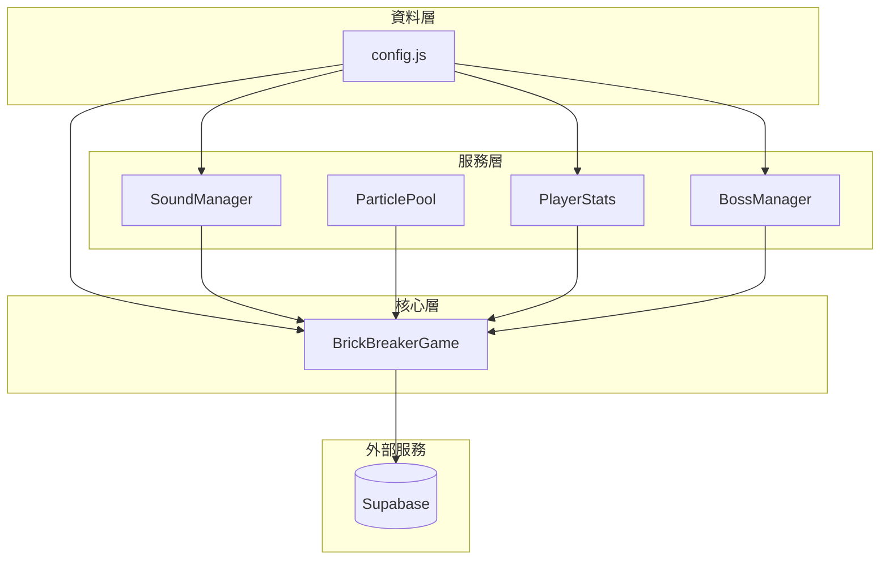
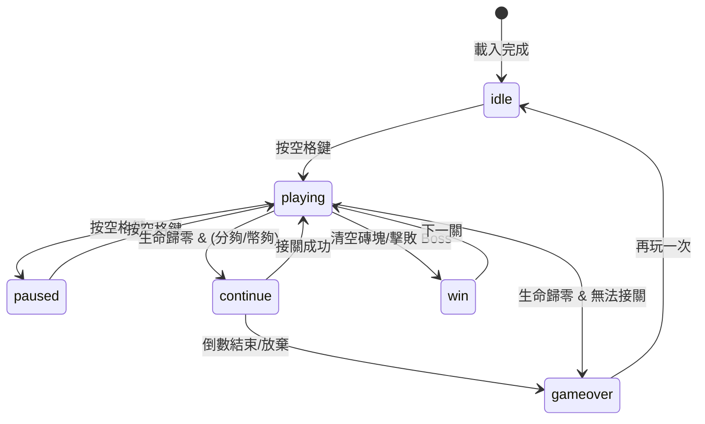

# system.md - 系統架構總覽

> **依賴聲明**：本文件引用 `data.md` 和 `api.md` 中定義的資料結構與接口。

---

## 模組載入順序

```html
<script src="config.js"></script>        <!-- 常數、i18n -->
<script src="SoundManager.js"></script>  <!-- 音效管理 -->
<script src="ParticleSystem.js"></script><!-- 粒子效果 -->
<script src="AchievementSystem.js"></script><!-- 成就系統 -->
<script src="BossManager.js"></script>   <!-- Boss 系統 -->
<script src="game.js"></script>          <!-- 主邏輯 -->
```

---

## 模組依賴圖



---

## 遊戲狀態機



---

## 關卡進程規則

### 磚塊配置

| 關卡 | 圖案 | 特殊磚塊 |
|------|------|----------|
| 1 | 完整矩形（跳過首排） | 💣 炸彈 |
| 2 | 金字塔 | 💣 + ⭐ 金磚 |
| 3 | 鑽石 | 💣 + ⭐ + ⚡ 閃電 |
| 4 | 棋盤格 | + 🛡️ 護盾 |
| 5 | 愛心 ❤️ | + ❄️ 冰凍 + 🌀 傳送 + 🎲 隨機 |
| 6 | 波浪 | 全部類型 |
| 7+ | 循環 1-6 | 全部類型 |

### Boss 關卡

- **每 7 關**（L7, L14, L21...）：Boss 圖案（皇冠形狀）
- **L14+**：Dragon Boss 實體出現
- **磚塊資源**：Boss 關卡磚塊行數 +2（從 5 行變 7 行）
- **菁英磚塊**：Boss 關卡生成 1-3 個
- **通關條件**：擊敗最終 Boss (L28 Mecha) 顯示通關畫面

### 球速遞增

```
球速 = min(初始球速 + (關卡 - 1) × 0.2, 7.0)
```

### BGM 主題配置

| 關卡範圍 | BGM 主題 | 風格 |
|----------|----------|------|
| 1-9 關 | `normal` → `journey` → `adventure` 循環 | 歡快冒險 |
| 10-14 關 | `mystic` | 神秘空靈 |
| 15-19 關 | `fast` | 快節奏 |
| 20+ 關 | `triumph` | 勝利凱旋 |
| Boss 關卡 | `boss` | 緊張威脅 |

---

## 每日挑戰機制

### Seeded RNG

使用當天日期作為隨機數種子，確保所有玩家每天玩到相同的關卡配置。

```javascript
const today = new Date();
const seed = `${today.getFullYear()}${String(today.getMonth() + 1).padStart(2, '0')}${String(today.getDate()).padStart(2, '0')}`;
this.rng = new SeededRNG(parseInt(seed));
```

### 排行榜

- 相同 `seed` 的玩家可比較分數
- 排行榜顯示當日挑戰者

---

## 遊戲循環

```javascript
gameLoop() {
    const now = performance.now();
    const deltaTime = now - this.lastTime;
    this.lastTime = now;

    if (gameState === 'playing') {
        update(deltaTime);    // 物理更新
        checkCollisions();    // 碰撞檢測
        updatePowerups();     // 道具系統
        updateBoss();         // Boss 更新
    }
    
    draw();                   // 渲染
    requestAnimationFrame(gameLoop);
}
```

---

## CSS 模組結構

| 檔案 | 職責 |
|------|------|
| `variables.css` | CSS 變數定義 |
| `base.css` | 重置與基礎樣式 |
| `layout.css` | 佈局容器 |
| `components.css` | 按鈕、卡片等組件 |
| `modals.css` | 所有 Modal 樣式 |
| `animations.css` | 動畫效果 |
| `responsive.css` | 響應式斷點 |
| `main.css` | 入口檔案（@import 其他） |

---

## PWA 支援

- `manifest.json`：應用程式清單
- `service-worker.js`：離線快取
- 支援「安裝至桌面」
