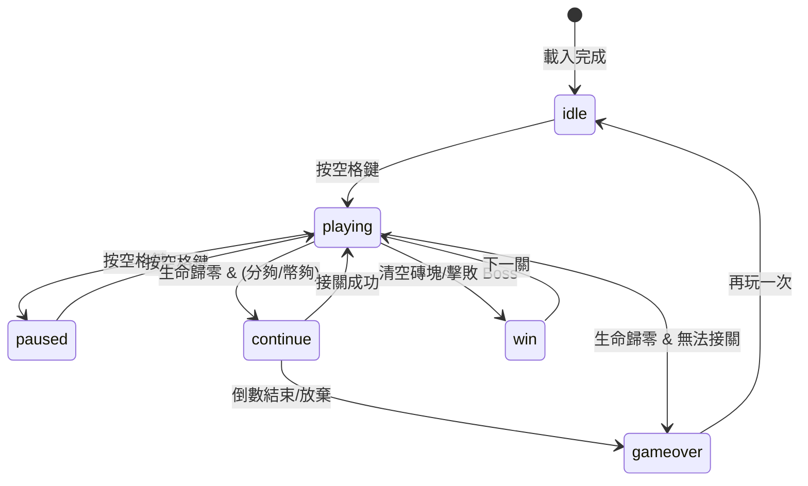

# system.md - 系統架構總覽

> **依賴聲明**：本文件引用 `data.md` 和 `api.md` 中定義的資料結構與接口。

---

## 模組載入順序

```html
<script src="config.js"></script>        <!-- 常數、i18n -->
<script src="SoundManager.js"></script>  <!-- 音效管理 -->
<script src="ParticleSystem.js"></script><!-- 粒子效果 -->
<script src="AchievementSystem.js"></script><!-- 成就系統 -->
<script src="BossManager.js"></script>   <!-- Boss### 3.1 核心遊戲循環
- `startGame()`: 初始化遊戲狀態、重置分數、播放 BGM（區間不重複系統）。
- `gameLoop()`: 主循環，處理暫停、結束狀態 check。
- `update(deltaTime)`: 更新所有實體（擋板、球、磚塊、粒子、Boss）。
- `draw()`: 渲染所有遊戲元素。

### 3.2 關卡與難度系統
- **關卡結構**：
  - 總關卡數：28
  - Boss 關卡：L7 (Mini), L14 (Dragon), L21 (Kraken), L28 (Mecha)
  - 每個一般的關卡都有不同的排列。
- **BGM 系統**：
  - 採用區間內不重複機制（4 個區間 × 6 種主題）。
  - 前期（L1-6）、中期（L8-13）、後期（L15-20）、終盤（L22-27）每區間循環所有非 Boss 主題。
  - Boss 關卡強制使用 `boss` 主題。
- **難度遞進**：
  - 球速隨關卡增加。
  - 特殊磚塊與菁英磚塊出現率提升。

### 3.3 音效與視覺回饋
- **音效管理 (`SoundManager`)**：
  - 支援 Web Audio API。
  - BGM 播放與循環（支援 7 種主題：normal, journey, adventure, mystic, fast, triumph, boss）。
  - 各種遊戲音效（擊打、得分、GameOver 等）。
  - **移動端優化**：
    - 強制音效解鎖：使用者首次互動時呼叫 `sound.init()` 以恢復 AudioContext。
- **視覺效果**：
  - 粒子系統 (`ParticleSystem`)：擊破磚塊、Boss 攻擊特效。
  - 畫面震動 (`ScreenShake`)：受到傷害或強力撞擊時觸發。
  - 符號識別：
    - 💎 穿透球 (Pierce)
    - 🔮 磁力核心 (Magnet Elite)
    - ⚡ 雷電系 (Thunder Elite / Mecha Boss)
    - 🔥 火焰系 (Fireball / Flame Elite)

### 3.4 存檔與排行榜
- 使用 `localStorage` 儲存：
  - 最高分 (`brickBreakerHighScore`)
  - 設置（音效、BGM 開關、語言）
  - 解鎖成就

### 3.5 生命與接關系統
- **初始生命**：3 條
- **生命上限**：10 條
- **接關機制**：
  - 費用：15000 分 或 1 代幣
  - 倒數：5 秒
  - 效果：恢復 3 命 + 3 秒無敵 
subgraph 外部服務
        SUPABASE[(Supabase)]
    end
    
    CONFIG --> SOUND
    CONFIG --> STATS
    CONFIG --> BOSS
    CONFIG --> GAME
    
    SOUND --> GAME
    PARTICLE --> GAME
    STATS --> GAME
    BOSS --> GAME
    
    GAME --> SUPABASE
    SCALER -.responsive.-> GAME
```

**新增（v1.7）：** `MobileScalingManager` - 管理響應式縮放邏輯，從 HTML 內聯腳本重構為獨立類別。

**新增（v1.8）：** 移動端優化
- **全螢幕模式**：`requestFullscreen` 整合。
- **直式佈局**：Top Alignment + Bottom Control Zone (CSS)。

## 遊戲狀態機



---

## 關卡進程規則

### 磚塊配置

| 關卡 | 圖案 | 特殊磚塊 |
|------|------|----------|
| 1 | 完整矩形（跳過首排） | 💣 炸彈 |
| 2 | 金字塔 | 💣 + ⭐ 金磚 |
| 3 | 鑽石 | 💣 + ⭐ + ⚡ 閃電 |
| 4 | 棋盤格 | + 🛡️ 護盾 |
| 5 | 愛心 ❤️ | + ❄️ 冰凍 + 🌀 傳送 + 🎲 隨機 |
| 6 | 波浪 | 全部類型 |
| 7+ | 循環 1-6 | 全部類型 |

### Boss 關卡

- **每 7 關**（L7, L14, L21...）：Boss 圖案（皇冠形狀）
- **L14+**：Dragon Boss 實體出現
- **磚塊資源**：Boss 關卡磚塊行數 +2（從 5 行變 7 行）
- **菁英磚塊**：Boss 關卡生成 1-3 個
- **通關條件（v1.7）**：
  - **正常模式**：擊敗最終 Boss (L28 Mecha) → `gameCompleted = true` → 顯示通關畫面
  - **無盡模式**：L28 後繼續遊戲，不觸發通關

### 球速遞增

```
球速 = min(初始球速 + (關卡 - 1) × 0.26, 7.0)  // v1.9: 0.2 → 0.26
```

### BGM 主題配置

| 關卡範圍 | BGM 主題 | 風格 |
|----------|----------|------|
| 1-9 關 | `normal` → `journey` → `adventure` 循環 | 歡快冒險 |
| 10-14 關 | `mystic` | 神秘空靈 |
| 15-19 關 | `fast` | 快節奏 |
| 20+ 關 | `triumph` | 勝利凱旋 |
| Boss 關卡 | `boss` | 緊張威脅 |

---

## 每日挑戰機制

### Seeded RNG

使用當天日期作為隨機數種子，確保所有玩家每天玩到相同的關卡配置。

```javascript
const today = new Date();
const seed = `${today.getFullYear()}${String(today.getMonth() + 1).padStart(2, '0')}${String(today.getDate()).padStart(2, '0')}`;
this.rng = new SeededRNG(parseInt(seed));
```

### 排行榜

- 相同 `seed` 的玩家可比較分數
- 排行榜顯示當日挑戰者

---

## 遊戲循環

```javascript
gameLoop() {
    const now = performance.now();
    const deltaTime = now - this.lastTime;
    this.lastTime = now;

    if (gameState === 'playing') {
        update(deltaTime);    // 物理更新
        checkCollisions();    // 碰撞檢測
        updatePowerups();     // 道具系統
        updateBoss();         // Boss 更新
    }
    
    draw();                   // 渲染
    requestAnimationFrame(gameLoop);
}
```

---

## CSS 模組結構

| 檔案 | 職責 |
|------|------|
| `variables.css` | CSS 變數定義 |
| `base.css` | 重置與基礎樣式 |
| `layout.css` | 佈局容器 |
| `components.css` | 按鈕、卡片等組件 |
| `modals.css` | 所有 Modal 樣式 |
| `animations.css` | 動畫效果 |
| `responsive.css` | 響應式斷點 |
| `main.css` | 入口檔案（@import 其他） |

---

## PWA 支援

- `manifest.json`：應用程式清單
- `service-worker.js`：離線快取
- 支援「安裝至桌面」

---

## PWA 支援

- `manifest.json`：應用程式清單
- `icon-192.png`, `icon-512.png`：應用圖示
- 支援安裝至桌面
- 支援離線遊玩

---

## 粒子系統優化（v1.7）

- **粒子池容量**：從 200 提升至 500
- **目的**：支援極限場景（無盡模式 + 多球 + 連環爆炸）
- **記憶體影響**：每個粒子約 100 bytes，總增加 ~30KB

---

## 訪客統計系統（v1.14 重構）

- **獨立容錯**：每個查詢獨立失敗，不影響其他
- **DOM 安全**：`safeSetText` 防止 null 元素崩潰
- **並行查詢**：`Promise.all` 提升效率
- **漸進式降級**：有多少資料顯示多少

---

## 排行榜功能（v1.15-v1.19 重構）

### v1.15 安全強化
- **DOM 安全檢查**：`_safeGetEl`, `_safeSetText`, `_safeSetHtml` 輔助函式
- **防重複提交**：`_isSavingScore` 旗標
- **名稱驗證**：最多 12 字元，自動清理

### v1.16 主選單按鈕
- **新增 `#mainLeaderboardBtn`**：玩家可在主畫面直接查看排行榜

### v1.18 關閉按鈕修復
- **事件綁定移至建構子**：確保全域可用

### v1.19 UX 改進
- **Modal 背景關閉**：`_setupModalBackdropClose` 統一處理 5 個 Modal
- **排行榜快取**：2 分鐘 TTL，減少 API 請求

---

## Modal 樣式統一（v1.20）

- **標題顏色**：統一為金色 `--accent-gold`
- **字體大小**：1.8rem
- **文字陰影**：`text-shadow: 0 2px 4px rgba(0,0,0,0.5)`
- **成就項目文字**：改為白色 `#fff`

---

## 行動版全螢幕（v1.21）

- **直式方向鎖定**：`screen.orientation.lock('portrait')`
- **PWA Manifest**：`orientation: portrait`
- **退出全螢幕解鎖**：`screen.orientation.unlock()`
